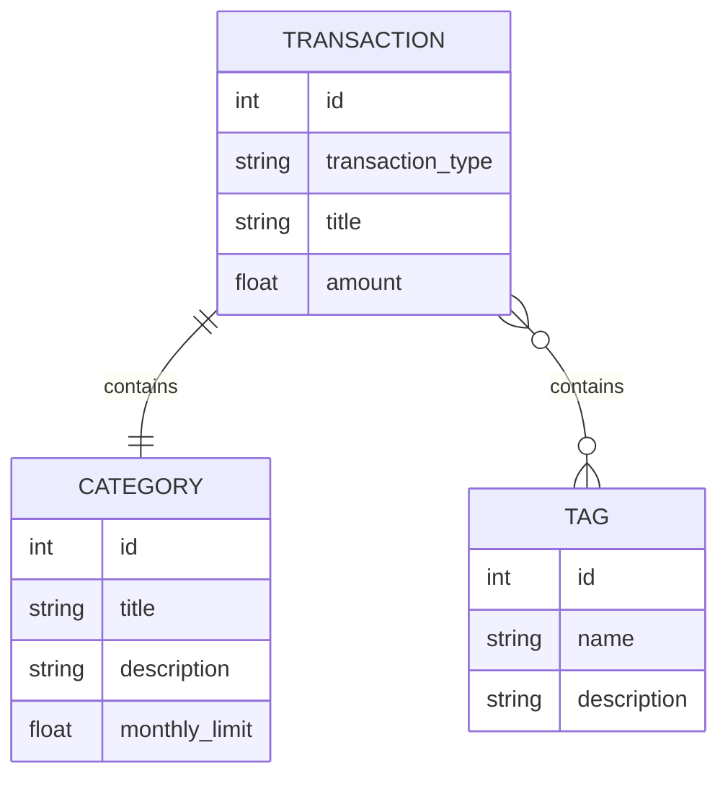

# Practice 1.1

Практика 1.1 посвящена созданию базового приложения на FastAPI без настоящей базы данных. В этой папке реализован самостоятельный мини-проект по теме сервиса управления личными финансами. Он не зависит от других практик и может запускаться отдельно.

Главная идея практики: показать, как создать FastAPI-приложение, описать Pydantic-модели, завести временную базу данных в памяти и реализовать простые CRUD-эндпоинты.

## Предметная область

По теме работы нужно разработать сервис для управления личными финансами. В первой практике для этого выбраны три сущности:

- `Transaction` — финансовая операция, то есть доход или расход.
- `Category` — категория операции, например зарплата, еда или транспорт.
- `Tag` — дополнительная метка операции, например регулярная, карта или наличные.

Модель `Transaction` сделана главной. Она содержит одиночный вложенный объект `Category` и список вложенных объектов `Tag`. Это соответствует требованию практики для своего варианта: главная таблица должна иметь одиночный вложенный объект и список объектов.

## Структура проекта

```text
practice_1_1/
├── main.py
├── models.py
├── requirements.txt
└── README.md
```

Назначение файлов:

- `main.py` — точка входа FastAPI-приложения, временные данные и API-эндпоинты.
- `models.py` — Pydantic-модели и типы ответов.
- `requirements.txt` — зависимости для запуска.
- `README.md` — описание проекта, архитектуры и примеров запросов.

## Используемые технологии

- Python 3.10+ рекомендуется по методичке.
- FastAPI используется для создания API.
- Pydantic используется для описания и валидации моделей.
- Uvicorn используется как ASGI-сервер для запуска приложения.

## Модели данных

### TransactionType

Перечисление типа операции.

```python
class TransactionType(str, Enum):
    income = "income"
    expense = "expense"
```

Значения:

- `income` — доход.
- `expense` — расход.

### Category

Категория финансовой операции.

```python
class Category(BaseModel):
    id: int
    title: str
    description: str
    monthly_limit: float
```

Поля:

- `id` — идентификатор категории.
- `title` — название категории.
- `description` — описание.
- `monthly_limit` — месячный лимит расходов по категории.

### Tag

Метка операции.

```python
class Tag(BaseModel):
    id: int
    name: str
    description: str
```

Поля:

- `id` — идентификатор тега.
- `name` — название тега.
- `description` — описание тега.

### Transaction

Главная модель практики.

```python
class Transaction(BaseModel):
    id: int
    transaction_type: TransactionType
    title: str
    amount: float
    category: Category
    tags: Optional[List[Tag]] = Field(default_factory=list)
```

Поля:

- `id` — идентификатор операции.
- `transaction_type` — тип операции: доход или расход.
- `title` — название операции.
- `amount` — сумма.
- `category` — вложенный объект категории.
- `tags` — список вложенных тегов.

## Схема связей



В этой практике это не настоящие SQL-связи, а вложенные Pydantic-объекты внутри временной базы данных.

## Временная база данных

В `main.py` созданы три списка:

- `temp_categories`
- `temp_tags`
- `temp_transactions`

Они имитируют базу данных. При запуске приложения данные находятся в оперативной памяти. Если сервер перезапустить, все изменения, сделанные через POST, PUT и DELETE, сбросятся к исходному состоянию.

Начальные данные включают:

- категорию `Salary`;
- категорию `Food`;
- категорию `Transport`;
- несколько тегов;
- три финансовые операции.

## Архитектура работы приложения

1. Пользователь отправляет HTTP-запрос.
2. FastAPI выбирает функцию по адресу и HTTP-методу.
3. Если запрос содержит тело, FastAPI валидирует его по Pydantic-модели.
4. Функция работает со списком в памяти.
5. Ответ возвращается в JSON-формате.
6. Swagger-документация автоматически строится на основе типов и моделей.

## API-эндпоинты

### Базовый эндпоинт

| Метод | URL | Назначение |
|---|---|---|
| GET | `/` | Проверка, что приложение работает |

Пример ответа:

```json
"Hello, personal finance user!"
```

### Операции

| Метод | URL | Назначение |
|---|---|---|
| GET | `/transactions_list` | Получить список всех операций |
| GET | `/transaction/{transaction_id}` | Получить одну операцию по id |
| POST | `/transaction` | Создать операцию |
| PUT | `/transaction{transaction_id}` | Полностью обновить операцию |
| DELETE | `/transaction/delete{transaction_id}` | Удалить операцию |

Пример создания операции:

```json
{
  "id": 4,
  "transaction_type": "expense",
  "title": "Books for university",
  "amount": 3200,
  "category": {
    "id": 4,
    "title": "Education",
    "description": "Courses, books and study materials",
    "monthly_limit": 15000
  },
  "tags": [
    {
      "id": 4,
      "name": "study",
      "description": "Education related transaction"
    }
  ]
}
```

Пример ответа:

```json
{
  "status": 200,
  "data": {
    "id": 4,
    "transaction_type": "expense",
    "title": "Books for university",
    "amount": 3200,
    "category": {
      "id": 4,
      "title": "Education",
      "description": "Courses, books and study materials",
      "monthly_limit": 15000
    },
    "tags": [
      {
        "id": 4,
        "name": "study",
        "description": "Education related transaction"
      }
    ]
  }
}
```

### Категории

| Метод | URL | Назначение |
|---|---|---|
| GET | `/categories_list` | Получить список категорий |
| GET | `/category/{category_id}` | Получить категорию по id |
| POST | `/category` | Создать категорию |
| PUT | `/category{category_id}` | Обновить категорию |
| DELETE | `/category/delete{category_id}` | Удалить категорию |

Пример создания категории:

```json
{
  "id": 5,
  "title": "Health",
  "description": "Medicine, doctors and sport",
  "monthly_limit": 20000
}
```

### Теги

| Метод | URL | Назначение |
|---|---|---|
| GET | `/tags_list` | Получить список тегов |
| GET | `/tag/{tag_id}` | Получить тег по id |
| POST | `/tag` | Создать тег |
| PUT | `/tag{tag_id}` | Обновить тег |
| DELETE | `/tag/delete{tag_id}` | Удалить тег |

Пример создания тега:

```json
{
  "id": 5,
  "name": "important",
  "description": "Important transaction"
}
```

## Запуск

```bash
cd practice_1_1
python3 -m venv .venv
source .venv/bin/activate
pip install -r requirements.txt
uvicorn main:app --reload
```

После запуска:

- API: http://127.0.0.1:8000
- Swagger UI: http://127.0.0.1:8000/docs
- ReDoc: http://127.0.0.1:8000/redoc

## Как проверить практику

1. Запустить приложение.
2. Открыть `/docs`.
3. Выполнить `GET /transactions_list`.
4. Создать новую категорию через `POST /category`.
5. Создать новый тег через `POST /tag`.
6. Создать новую операцию через `POST /transaction`.
7. Проверить, что операция появилась через `GET /transactions_list`.
8. Обновить операцию через `PUT /transaction{transaction_id}`.
9. Удалить операцию через `DELETE /transaction/delete{transaction_id}`.

## Что было изучено в практике

- создание объекта `FastAPI`;
- описание GET, POST, PUT и DELETE эндпоинтов;
- работа с path-параметрами;
- прием тела запроса;
- описание Pydantic-моделей;
- использование enum-типов;
- использование вложенных моделей;
- автоматическая генерация Swagger-документации;
- базовый CRUD без настоящей базы данных.
